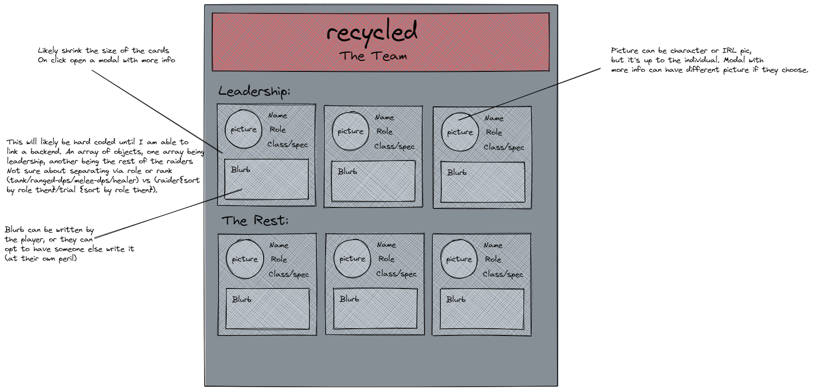

# recycled.gg

 

A website designed to show off the World of Warcraft guild <recycled> on the Zul'jin server. This is a personal project by a member of the guild, and anything found on the site is personal opinion, and does not reflect the stance of the guild or it's members.

They site is currently deployed on Netlify and can be found at [recycled.netlify.app](https://recycled.netlify.app/)

Built using React.js and Material UI.

Wireframe of homepage

Wireframe of team page

Using an API call to a google sheet, I should be able to display "news" stories and player "cards", and insert the data into the Google sheet via a connected Google Form.

